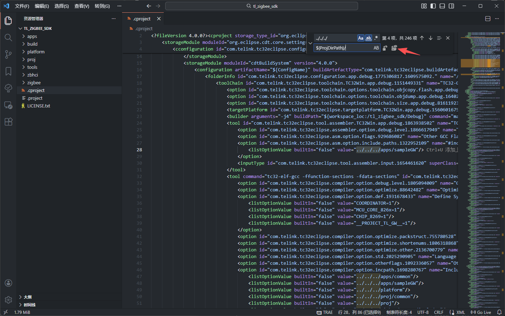
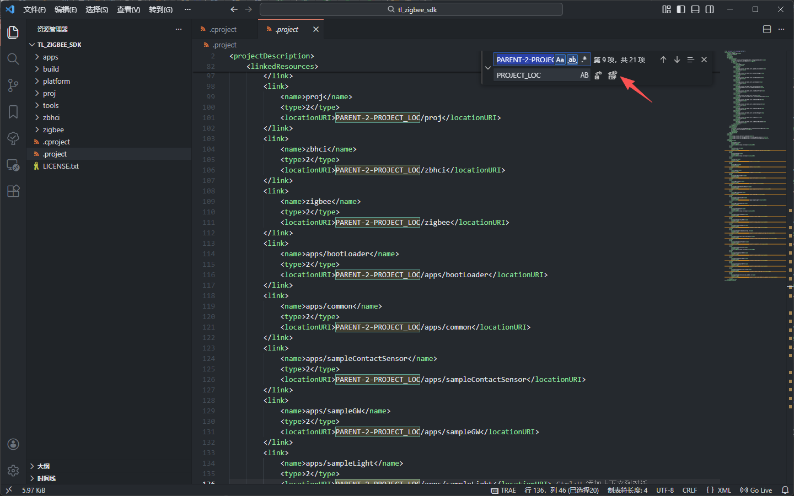
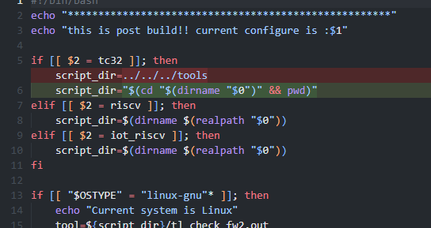
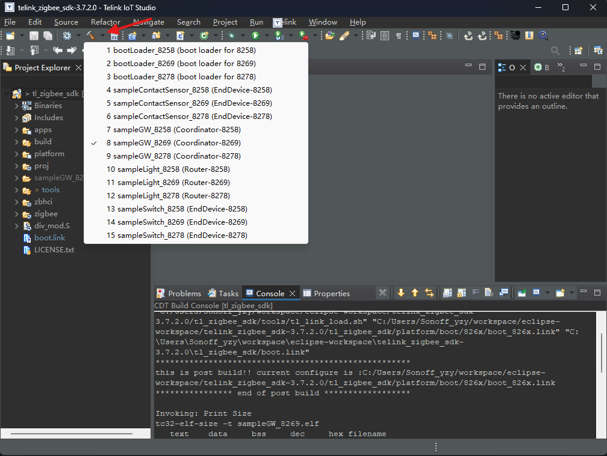
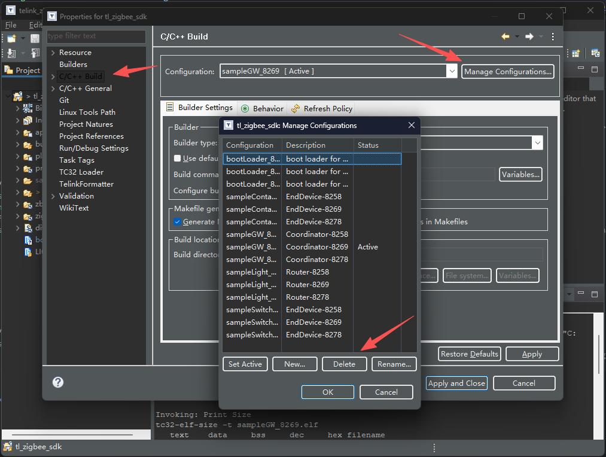

# **Telink 学习**

## **相关文档**

## **Telink 创建工程**

### **修改工程配置文件**

复制 telink_zigbee_sdk-3.7.2.0\tl_zigbee_sdk\build 文件夹下面自己需要的工程配置文件到 telink_zigbee_sdk-3.7.2.0\tl_zigbee_sdk 文件夹下。

使用任意文本编辑器（如，VSCode）打开工程文件夹，将 .cproject 中的 ../../../ 全部替换为 ${ProjDirPath}/ 。

PARENT-2-PROJECT_LOC 全部替换为 PROJECT_LOC，若之前使用 Telink IOT Studio 打开过工程导致 .project 中 PARENT-2 将被修改为 PROJECT/../../ 做出相应替换即可。

### **修改脚本**

修改 tl_check_fw.sh 脚本，如下图。

将 script_dir=../../../tools 替换为 script_dir="$(cd "$(dirname "$0")" && pwd)"。

### **编译**

通过 Telink IOT Studio 选择 tl_zigbee_sdk 的上级目录作为工作区导入该工程编译即可。

### **更换** buildSystemId

删除 buildSystemId 如下。

